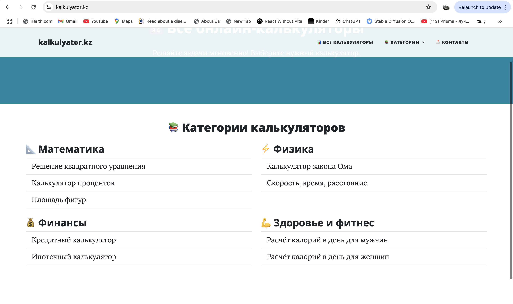
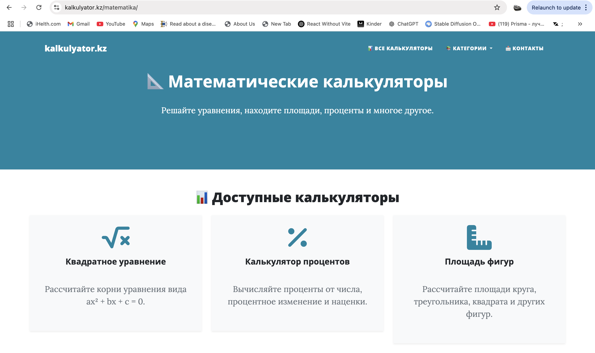
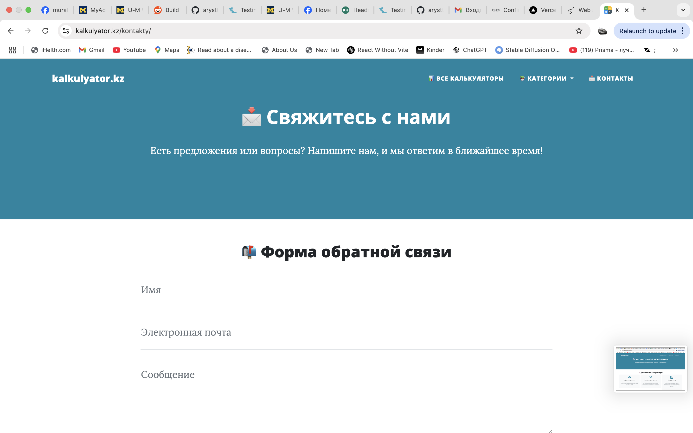

# kalkulyator.kz

A modern, SEO-friendly web application providing a catalog of free online calculators for mathematics, physics, finance, and health. Built with Flask, it features a clean UI, dynamic sitemap, and is optimized for both users and search engines.

## Features
- 🧮 Wide range of calculators: Math, Physics, Finance, Health
- 📱 Responsive design (Bootstrap)
- 🔍 SEO optimized (dynamic sitemap, meta tags, robots.txt)
- ⚡ Fast with server-side caching
- 📂 Well-organized codebase and templates
- 📝 Contact form with database-backed inquiry storage

## Screenshots

### All Calculators


### Math Calculators


### Contact Form


## Demo
Live: [https://www.kalkulyator.kz](https://www.kalkulyator.kz)

> **Note:** Deployment is currently not available. If you want to run the project, please follow the local installation instructions below.

## Installation

### 0. Configure Environment Variables

1. Copy the example environment file:
   ```bash
   cp example.env .env
   ```
2. Edit `.env` to set your domain and database path as needed:
   - `DOMAIN`: The base URL of your site (e.g., https://www.kalkulyator.kz)
   - `DATABASE_URL`: The database connection string (default: sqlite:///kalkulyator.db)

1. **Clone the repository:**
   ```bash
   git clone https://github.com/arysttoto/kalkulyator.git
   cd kalkulyator
   ```
2. **Create and activate a virtual environment:**
   ```bash
   python3 -m venv env
   source env/bin/activate
   ```
3. **Install dependencies:**
   ```bash
   pip install -r requirements.txt
   ```
4. **Run the application:**
   ```bash
   python app.py
   ```
   The app will be available at `http://127.0.0.1:5000/` by default.

## Project Structure
```
kalkulyator/
├── app.py                # Main Flask application
├── requirements.txt      # Python dependencies
├── templates/            # Jinja2 HTML templates
├── static/               # Static files (CSS, JS, images)
│   └── readme/           # Screenshots for README
├── kalkulyator.db        # SQLite database (ignored by git)
└── LICENSE               # Apache 2.0 License
```

## Technologies Used
- Python 3
- Flask
- Flask-Session
- Flask-Caching
- CS50 SQL
- Bootstrap 5

## License

This project is licensed under the [Apache License 2.0](LICENSE). 